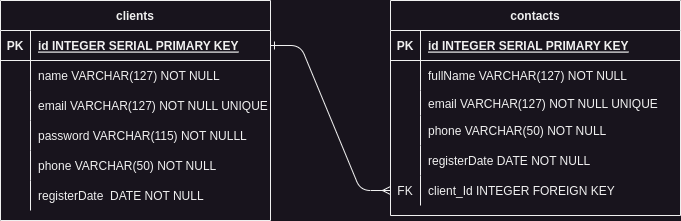

<h2>Descrição</h2><br>
<p>
API que consiste em criar um pequeno cadastro de clientes com vínculo de contatos, depois mostrar o cliente e o seus contatos vinculados.
</p><br>

# Documentação da API

URL da aplicação:
http://localhost:3000

Alguma das tecnologias utilizadas.

- [TypeScript](https://www.typescriptlang.org/)
- [NodeJS](https://nodejs.org/en/)
- [PostgreSQL](https://www.postgresql.org/)
- [Express](https://expressjs.com/pt-br/)
- [TypeORM](https://typeorm.io/)
- [Zod](https://yarnpkg.com/package/zod)

## Diagrama de Entidade de Relacionamentos (DER)



### Instalando Dependências

Clone o projeto em sua máquina e instale as dependências utilizando o comando:

```
npm i
```

### Variáveis de Ambiente

crie um arquivo **.env**, copiando o formato do arquivo **.env.example**:

```
.env.example .env
```

Configure suas variáveis de ambiente com suas credenciais do PostgresSQL e um novo banco de dados para estar utilizando no projeto.

### Migrations

Execute as migrations com o comando:

```
npm run typeorm migration:generate src/migrations/create<nome-da-class> -- -d src/data-source.ts
npm exec -- npm run typeorm -- migration:run -d src/data-source.ts

```

## **clients**

## Endpoints Clients

| Método | Rota         | Descrição                                         |
| ------ | ------------ | ------------------------------------------------- |
| POST   | /clients     | Criação de um cliente.                            |
| GET    | /clients     | Lista todos os clientes.                          |
| GET    | /clients/:id | Lista um cliente, usando seu ID como parâmetro    |
| PATCH  | /clients/:id | Atualiza um cliente, usando seu ID como parâmetro |
| DELETE | /clients/:id | Deleta um cliente, usando seu ID como parâmetro   |

---

### **Criar Cliente**

### Exemplo de Request:

```
POST /clients
Host: http://localhost:3000
Authorization: None
Content-type: application/json
```

### Corpo da Requisição:

```json
{
  "name": "Jonas",
  "email": "jonas@mail.com",
  "password": "1234",
  "phone": "61998556679"
}
```

### Resposta da Requisição:

```json
{
	"name": "Jonas",
	"email": "jonas@mail.com",
	"phone": "61998556679",
	"id": 1,
	"registerDate": "2023-06-08T20:14:23.803Z"
}

OBS: Não tem retorno de senha na resposta.
```

### **Listar todos Clientes**

```
GET /clients
Host: http://localhost:3000
Authorization: necessita do token do cliente para acesso
Content-type: application/json
```

### Corpo da Requisição:

```
Não possui corpo na requisição.
```

### Resposta da Requisição:

```json
[
  {
    "name": "Jonas",
    "email": "jonas@mail.com",
    "phone": "61998556679",
    "id": 1,
    "registerDate": "2023-06-08T20:14:23.803Z"
  },
  {
    "name": "Gustavo",
    "email": "gustavo@mail.com",
    "phone": "6199574531",
    "id": 2,
    "registerDate": "2023-06-08T20:14:25.803Z"
  },
  {
    "name": "Eduardo",
    "email": "eduardo@mail.com",
    "phone": "619936547825",
    "id": 3,
    "registerDate": "2023-06-08T20:14:28.803Z"
  }
]
```

### 1.3. **Listar Cliente por id**

### Exemplo de Request:

```
GET /clients/:id
Host: http://localhost:3000
Authorization: necessita do token do cliente para acesso
Content-type: application/json
```

### Corpo da Requisição:

```
Não possui corpo na requisição.
```

### Resposta da Requisição:

```json
{
	"client": {
		"name": "Jonas",
		"email": "jonas@mail.com",
		"phone": "61998556679",
		"id": 6,
		"registerDate": "2023-06-08T20:14:23.803Z"
	},
	"contacts": [
		{
			"id": 2,
			"fullName": "Gustavo Dias",
			"email": "gustavo@mail.com",
			"phone": "6199574531",
			"registerDate": "2023-06-08T20:14:25.803Z"
		}
	]
}

OBS: Nesta rota tem a lista de contatos na resposta da requisição, se não houver contatos vem com um array vazio "[]".
```

### **Atualizar Cliente por id**

### Exemplo de Request:

```
PATCH /clients/:id
Host: http://localhost:3000
Authorization: necessita do token do cliente para acesso
Content-type: application/json
```

### Corpo da Requisição:

```json
{
  "name": "Jonas Dias",
  "email": "jonas123@mail.com"
}
```

### Resposta da Requisição:

```json
{
  "name": "Jonas Dias",
  "email": "jonas123@mail.com",
  "phone": "61998556679",
  "id": 1,
  "registerDate": "2023-06-08T20:14:23.803Z"
}
```

### **Deletar Cliente por id**

### Exemplo de Request:

```
DELETE /clients/:id
Host: http://localhost:3000
Authorization: necessita do token do cliente para acesso
Content-type: application/json
```

### Corpo da Requisição:

```
Não possui corpo na requisição.
```

### Resposta da Requisição:

```
204 no Content "nenhum corpo retornou para resposta"
```

### **Login**

### Exemplo de Request:

```
POST /login
Host: http://localhost:3000
Authorization: None
Content-type: application/json
```

### Corpo da Requisição:

```json
{
  "email": "jonas@mail.com",
  "password": "1234"
}
```

### Resposta da Requisição:

```json
{
  "token": "eyJhbGciOiJIUzI1NiIsInR5cCI6IkpXVCJ9.           eyJlbWFpbCI6ImpvbmFzQG1haWwuY29tIiwiaWF0IjoxNjg2MjU2NTUzLCJleHAiOjE2ODYzNDI5NTMsInN1YiI6IjcifQ.tKRxiYJCPTaqaF--YjFlGDHoiDVdvJmkU1DC2l_zuBk"
}
```

## **contacts**

### Endpoints

| Método | Rota          | Descrição                                         |
| ------ | ------------- | ------------------------------------------------- |
| POST   | /contacts     | Criação de um contato.                            |
| GET    | /contacts     | Lista todos os contatos.                          |
| GET    | /contacts/:id | Lista um contato, usando seu ID como parâmetro    |
| PATCH  | /contacts/:id | Atualiza um contato, usando seu ID como parâmetro |
| DELETE | /contacts/:id | Deleta um contato, usando seu ID como parâmetro   |

---

### **Criar Contato**

### Exemplo de Request:

```
POST /contacts
Host: http://localhost:3000
Authorization: necessita do token do cliente para acesso
Content-type: application/json
```

### Corpo da Requisição:

```json
{
  "fullName": "Gustavo Dias",
  "phone": "95164220",
  "email": "gustavo@mail.com"
}
```

### Resposta da Requisição:

```json
{
  "fullName": "Gustavo Dias",
  "email": "gustavo@mail.com",
  "phone": "95164220",
  "id": 2,
  "registerDate": "2023-06-08T20:25:56.111Z"
}
```

### **Listar todos Contatos**

```
GET /contacts
Host: http://localhost:3000
Authorization: necessita do token do cliente para acesso
Content-type: application/json
```

### Corpo da Requisição:

```
Não possui corpo na requisição.
```

### Resposta da Requisição:

```json
[
  {
    "fullName": "Gustavo Dias",
    "email": "gustavo@mail.com",
    "phone": "95164220",
    "id": 2,
    "registerDate": "2023-06-08T20:25:56.111Z"
  },
  {
    "fullName": "Eduardo Dias",
    "email": "eduardo@mail.com",
    "phone": "9516321320",
    "id": 3,
    "registerDate": "2023-06-08T20:43:57.233Z"
  }
]
```

### **Listar Contato por id**

### Exemplo de Request:

```
GET /contacts/:id
Host: http://localhost:3000
Authorization: necessita do token do cliente  para acesso
Content-type: application/json
```

### Corpo da Requisição:

```
Não possui corpo na requisição.
```

### Resposta da Requisição:

```json
{
	"fullName": "Eduardo Dias",
	"email": "eduardo@mail.com",
	"phone": "9516321320",
	"id": 3,
	"registerDate": "2023-06-08T20:43:57.233Z",
	"client": {
		"name": "Jonas",
		"email": "jonas@mail.com",
		"phone": "219821626",
		"id": ,
		"registerDate": "2023-06-08T20:35:49.907Z"
	}
}

OBS: Nesta rota tem a lista de clientes na resposta da requisição.
```

### **Atualizar Contato por id**

### Exemplo de Request:

```
PATCH /contacts/:id
Host: http://localhost:3000
Authorization: necessita do token do cliente para acesso
Content-type: application/json
```

### Corpo da Requisição:

```json
{
  "fullName": "Eduardo Silva",
  "email": "eduardo123@mail.com"
}
```

### Resposta da Requisição:

```json
{
  "fullName": "Eduardo Silva",
  "email": "eduardo123@mail.com",
  "phone": "9516321320",
  "id": 3,
  "registerDate": "2023-06-08T20:43:57.233Z"
}
```

### **Deletar Contato por id**

### Exemplo de Request:

```
DELETE /contacts/:id
Host: http://localhost:3000
Authorization: necessita do token do cliente para acesso
Content-type: application/json
```

### Corpo da Requisição:

```
Não possui corpo na requisição.
```

### Resposta da Requisição:

```
204 no Content "nenhum corpo retornou para resposta"
```

### Possíveis Erros:

| 401 Unauthorized | you don`t have permissions. |
| 401 Unauthorized | invalid token. |
